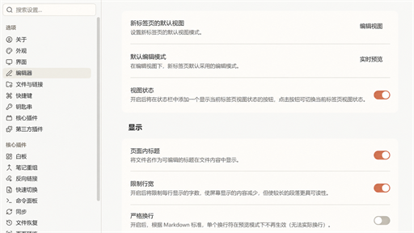
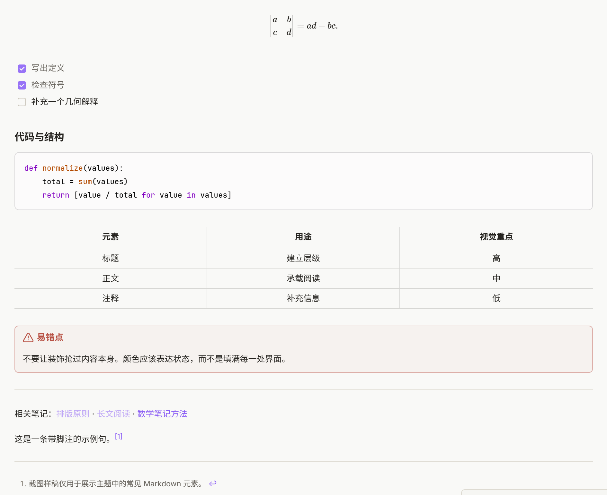

# Paper Ember

[简体中文](README.md)

Paper Ember is an Obsidian theme with soft paper-like backgrounds, restrained terracotta accents, and a calm visual hierarchy. It supports both light and dark modes.



## Features

- Soft paper tones in light mode and a layered charcoal palette in dark mode
- Consistent typography across Live Preview and Reading View
- Restrained headings, blockquotes, callouts, tables, and code blocks
- Clear syntax colors designed for both light and dark modes
- Support for Obsidian's native interface, text, and monospace font settings
- Interface refinements for commonly used plugins including Notebook Navigator and Claudian
- Optional Style Settings controls for colors, font size, line height, reading width, fonts, radii, and sidebar density

## Preview



## Installation

### Obsidian Community Themes

After Paper Ember is available in the Obsidian Community directory, search for `Paper Ember` under Settings → Appearance → Themes → Manage.

### Manual installation

1. Download the latest `manifest.json` and `theme.css` from [Releases](https://github.com/eonewg/paper-ember/releases).
2. Create a `Paper Ember` folder inside your vault's `.obsidian/themes/` directory.
3. Place both files in that folder.
4. Select `Paper Ember` under Settings → Appearance → Themes.

The final directory should look like this:

```text
your-vault/.obsidian/themes/Paper Ember/
├─ manifest.json
└─ theme.css
```

## Customization

[Style Settings](https://github.com/mgmeyers/obsidian-style-settings) is optional. When installed, it provides controls for the accent color, text size, line height, reading width, fonts, radii, and sidebar density. The theme works normally without it.

## Fonts

Fonts selected in Obsidian's native interface, text, and monospace font settings take priority over the theme defaults.

Otherwise, Paper Ember uses Inter when it is installed and falls back to Noto Sans SC and platform Chinese fonts. Code surfaces prefer Cascadia Code, Cascadia Mono, JetBrains Mono, and platform monospace fonts. The theme does not download fonts from the network.

## Compatibility

- Minimum Obsidian version: 1.13.0
- Light and dark modes are supported
- Style Settings is optional
- The theme is pure CSS and contains no runtime remote resources

## Acknowledgements

- Some component designs were inspired by [Cupertino](https://github.com/aaaaalexis/obsidian-cupertino). Thanks to aaaaalexis for the thoughtful design work and for sharing it openly.
- Thanks to Obsidian community reviewer [saberzero1](https://github.com/saberzero1) for documenting the Obsidian 1.13 Callout color change and providing the compatibility fix in [PR #3](https://github.com/eonewg/paper-ember/pull/3).

## License

Paper Ember is released under the [MIT License](LICENSE).
